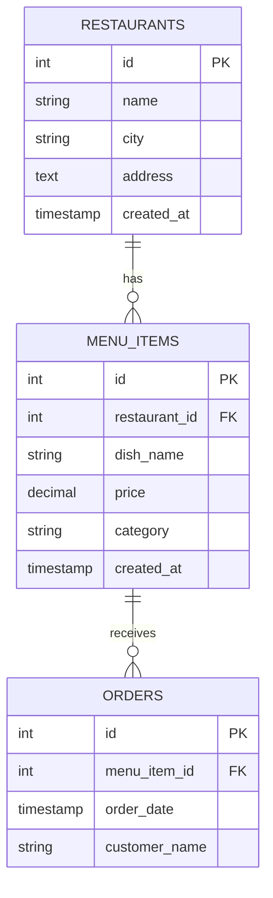

# 🍽️ Restaurant Search API

<div align="center">


**A powerful backend service to discover restaurants by their signature dishes** 🔍

[Live Demo](https://restaurant-search-k8ub.onrender.com/) • [Report Bug](https://github.com/raveenakale475/restaurant-search) • [Request Feature](https://github.com/raveenakale475/restaurant-search)

</div>

---

## ✨ Features

<table>
<tr>
<td width="50%">

### 🎯 Smart Search
Search restaurants by dish name with intelligent filtering

### 💰 Price Range Filter
Mandatory price filtering for budget-conscious decisions

</td>
<td width="50%">

### 🏆 Top Results
Returns top 10 restaurants ranked by popularity

### 📊 Rich Data
Comprehensive seed data with 15+ restaurants

</td>
</tr>
</table>

---

## 🚀 Quick Start

### Prerequisites

Before you begin, ensure you have:

- 📦 **Node.js** (v14 or higher) - [Download](https://nodejs.org/)
- 🗄️ **MySQL** (v5.7 or higher) - [Download](https://dev.mysql.com/downloads/)
- 📥 **npm** or **yarn**

### Installation
```bash
# 1️⃣ Clone the repository
git clone https://github.com/yourusername/restaurant-search-api.git
cd restaurant-search-api

# 2️⃣ Install dependencies
npm install

# 3️⃣ Set up environment variables
cp .env.example .env
# Edit .env with your database credentials

# 4️⃣ Create database
mysql -u root -p -e "CREATE DATABASE restaurant_db;"

# 5️⃣ Seed the database with sample data
npm run seed

# 6️⃣ Start the server
npm run dev
```

🎉 **Your API is now running on** `http://localhost:3000`

---

## 🎮 API Usage

### 🔍 Search Endpoint
```http
GET /search/dishes
```

### Parameters

| Parameter | Type | Required | Description |
|-----------|------|----------|-------------|
| `name` | string | ✅ Yes | Name of the dish to search |
| `minPrice` | number | ✅ Yes | Minimum price range |
| `maxPrice` | number | ✅ Yes | Maximum price range |

### 📝 Example Request
```bash
curl "http://localhost:3000/search/dishes?name=biryani&minPrice=150&maxPrice=300"
```

### ✅ Example Response
```json
{
  "restaurants": [
    {
      "restaurantId": 1,
      "restaurantName": "Hyderabadi Spice House",
      "city": "Hyderabad",
      "dishName": "Chicken Biryani",
      "dishPrice": 220,
      "orderCount": 96
    },
    {
      "restaurantId": 2,
      "restaurantName": "Paradise Biryani",
      "city": "Hyderabad",
      "dishName": "Chicken Biryani",
      "dishPrice": 250,
      "orderCount": 85
    }
  ],
  "meta": {
    "count": 10,
    "filters": {
      "dishName": "biryani",
      "minPrice": 150,
      "maxPrice": 300
    }
  }
}
```

---

## 🧪 Try It Out

### Using Browser
Simply paste in your browser:
```
http://localhost:3000/search/dishes?name=biryani&minPrice=150&maxPrice=300
```

### Using Thunder Client (VS Code)
1. Install Thunder Client extension
2. Create new GET request
3. Enter URL with parameters
4. Click **Send** 🚀

### Using Postman
1. Create new GET request
2. Enter URL: `http://localhost:3000/search/dishes`
3. Add query parameters
4. Hit **Send**

---

## 📁 Project Structure
```
restaurant-search-api/
│
├── 📂 src/
│   ├── 📂 config/
│   │   └── 📄 database.js         # Database connection
│   ├── 📂 models/
│   │   └── 📄 index.js            # Database schema
│   ├── 📂 controllers/
│   │   └── 📄 dishController.js   # Business logic
│   ├── 📂 routes/
│   │   └── 📄 dishRoutes.js       # API routes
│   └── 📄 app.js                  # Express app setup
│
├── 📂 seed/
│   └── 📄 seedData.js             # Sample data seeder
│
├── 📄 server.js                   # Entry point
├── 📄 package.json                # Dependencies
├── 📄 .env                        # Environment variables
└── 📄 README.md                   # You are here!
```

---

## 🛠️ Tech Stack

<table>
<tr>
<td align="center" width="25%">

<br><strong>Node.js</strong>
<br>Runtime Environment
</td>
<td align="center" width="25%">

<br><strong>Express.js</strong>
<br>Web Framework
</td>
<td align="center" width="25%">

<br><strong>MySQL</strong>
<br>Database
</td>
<td align="center" width="25%">

<br><strong>dotenv</strong>
<br>Config Management
</td>
</tr>
</table>

---

## 📊 Database Schema


---

## 🎯 Available Scripts

| Command | Description |
|---------|-------------|
| `npm start` | 🚀 Start production server |
| `npm run dev` | 🔧 Start development server with hot reload |
| `npm run seed` | 🌱 Populate database with sample data |

---

## 🌐 Deployment

### Deploy to Render

[](https://render.com/)

1. **Push to GitHub**
```bash
git add .
git commit -m "Ready for deployment"
git push origin main
```

2. **Deploy on Render**
- Connect your GitHub repository
- Add MySQL database
- Set environment variables
- Deploy! 🎉

3. **Your API is live at:**
```
https://restaurant-search-k8ub.onrender.com/
```

### Environment Variables for Production
```env
PORT=3000
DB_HOST=your-database-host
DB_PORT=3306
DB_USER=your-username
DB_PASSWORD=your-password
DB_NAME=restaurant_db
NODE_ENV=production
```

---

## 🧪 Testing

### Sample Test Cases
```bash
# ✅ Search for Biryani (₹150-300)
curl "http://localhost:3000/search/dishes?name=biryani&minPrice=150&maxPrice=300"

# ✅ Search for Paneer dishes (₹100-200)
curl "http://localhost:3000/search/dishes?name=paneer&minPrice=100&maxPrice=200"

# ✅ Search for Chicken dishes (₹200-280)
curl "http://localhost:3000/search/dishes?name=chicken&minPrice=200&maxPrice=280"

# ❌ Missing parameters (should return 400 error)
curl "http://localhost:3000/search/dishes?name=biryani"

# ❌ Invalid price range (should return error)
curl "http://localhost:3000/search/dishes?name=biryani&minPrice=300&maxPrice=100"
```

---

## 🎨 Key Highlights

### 🔐 Security Features
- ✅ Environment variable management
- ✅ SQL injection prevention with parameterized queries
- ✅ Input validation
- ✅ Error handling

### ⚡ Performance Optimizations
- ✅ Database connection pooling
- ✅ Indexed columns (dish_name, price)
- ✅ Optimized SQL queries with JOINs
- ✅ Efficient sorting and limiting

### 📈 Scalability
- ✅ Modular architecture
- ✅ Separation of concerns (MVC pattern)
- ✅ Easy to extend with new features
- ✅ Production-ready code

---

## 🤝 Contributing

Contributions are welcome! Here's how you can help:

1. 🍴 Fork the repository
2. 🔨 Create a feature branch (`git checkout -b feature/AmazingFeature`)
3. 💾 Commit your changes (`git commit -m 'Add some AmazingFeature'`)
4. 📤 Push to the branch (`git push origin feature/AmazingFeature`)
5. 🎉 Open a Pull Request

---

## 👨‍💻 Author

**Raveena Ramesh Kale**

- 🌐 Portfolio: [https://raveenakale475.github.io/](https://raveenakale475.github.io/)
- 💼 LinkedIn: [@raveenakale](https://www.linkedin.com/in/raveenakale/)
- 🐙 GitHub: [@raveenakale475](https://github.com/raveenakale475)
- 📧 Email: raveenar.kale@gmail.com

---

## 🙏 Acknowledgments

- Inspired by real-world food delivery platforms
- Built with ❤️ for learning and demonstration purposes

---

<div align="center">

### ⭐ Star this repo if you found it helpful!

**Made with ☕ and 💻**

[Back to Top ⬆️](#-restaurant-search-api)

</div>
